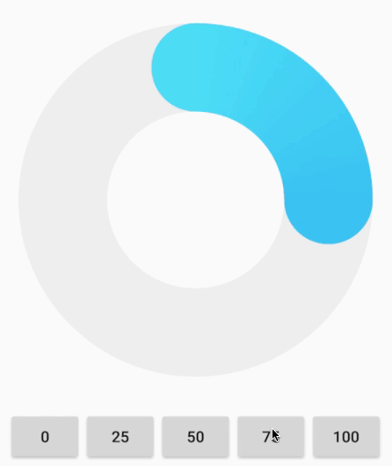

# GradientProgressBar



## Usage

Step 1. Add the JitPack repository in your root build.gradle at the end of repositories:

```
allprojects {
  repositories {
    ...
    maven { url 'https://jitpack.io' }
  }
}
```
  
Step 2. Add the dependency

```
dependencies {
    implementation 'com.github.Ryfthink:android-gradient-progress-bar:v0.0.1'
}
```